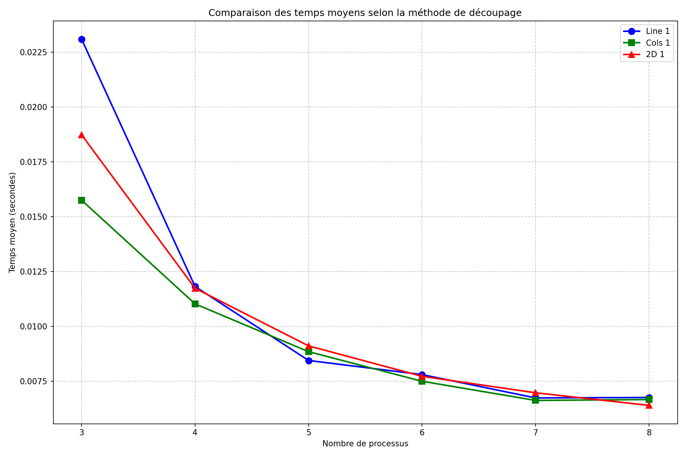
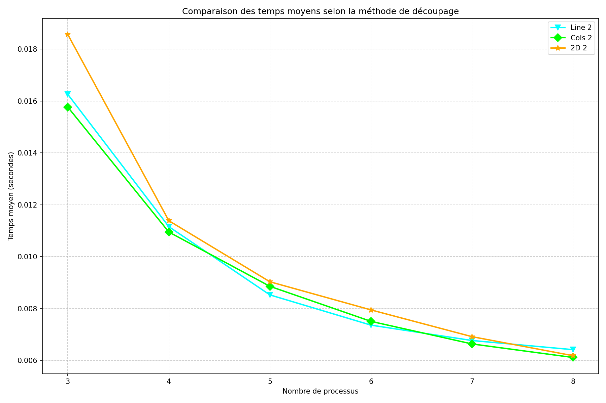
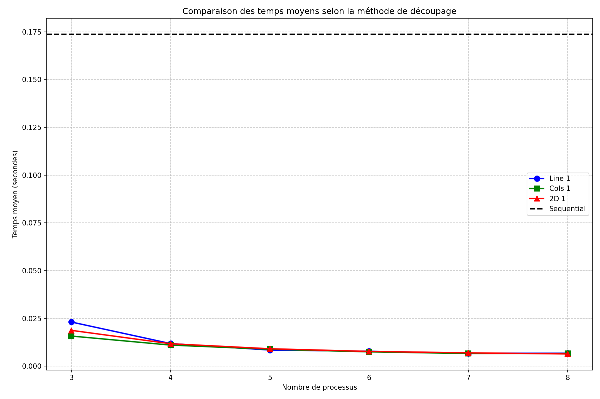
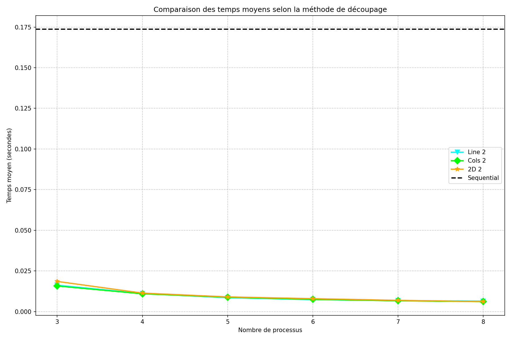
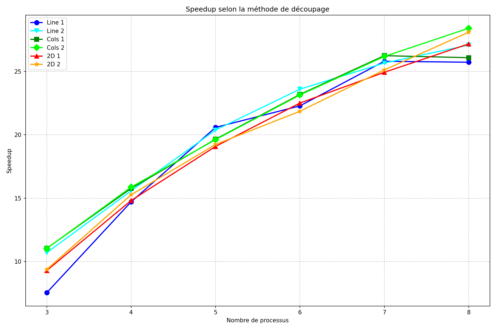
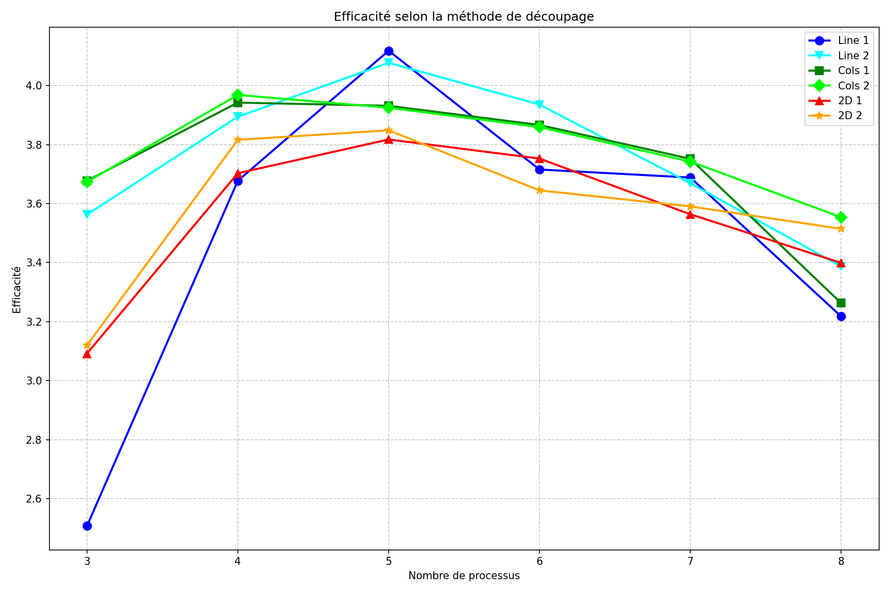

# Projet_GameOfLife
Un groupe de processus qui s'occupe de l'affichage et un autre pour les calculs.

# Auteurs

- DOHEMETO Bonaventure
- BURNS Thomas


# Game of Life MPI Performance Benchmark

Ce dépôt contient des scripts Python pour tester les performances de différentes implémentations parallèles du **Game of Life** en utilisant `MPI` via `mpiexec`.

## Contenu du projet

- `Avec_Sendrecv/Line.py` – Implémentation ligne par ligne  ( avec SendRecv)
- `Sans_Sendrecv/Line2.py` – Implémentation ligne par ligne  ( sans SendRecv) 
- `Avec_Sendrecv/Column.py` – Implémentation colonne par colonne  ( avec SendRecv)  
- `Sans_Sendrecv/Column2.py` – Implémentation colonne par colonne ( sans SendRecv)
- `Avec_Sendrecv/LC.py` – Implémentation mixte ( avec SendRecv)
- `Sans_Sendrecv/LC2.py` – Implémentation mixte ( sans SendRecv)
- `gol_performance.txt` – Tableau des temps moyens des tests MPI  
- `1_comparaison_temps_moyens.png` – Graphique sans la version sequentielle
- `1_comparaison_temps_moyens_seq.png` – Graphique avec la version sequentielle
- `2_comparaison_temps_moyens.png` – Graphique sans la version sequentielle
- `2_comparaison_temps_moyens_seq.png` – Graphique avec la version sequentielle
- `TESTs.py` - Pour lancer tous les tests de performances (avoir les temps moyens, les plots, le speed-up, l'efficiency)
-  <span style="color:red;">`IMPORTANT 🔴🔴🔴!`</span> - Avant de lancer le script TESTs.py, il faut aller dans les scripts sc1.py et sc3.py dans le dossier /Testsperformances et remplacer les valeurs de la liste suivante (procs_list = [3,4,5,6,7,8]), afin que le maximum des éléments ne dépasse pas le nombre de processus que votre PC peut lancer. Nous avons utilisé un max de 8 processus par défaut. 
 
.
├── Tests/
│   ├── TESTs.py
│   ├── tempsline_3.txt
│   ├── tempsline2_4.txt
│   ├── ...
│   └── tempsseq.txt
├── line.py
├── cols.py
├── 2D.py
├── README.md
└── speedup.png, efficiency.png, ...

## Description du script de benchmark

Le script principal exécute les tests de performance pour différents nombres de processus (`N proc`) et mesure le temps moyen d'exécution pour chaque implémentation.

### Paramètres testés

- **Pattern** : `glider`  
- **Résolution** : 200 × 200  
- **Durée** : Chaque script est lancé pendant 5 secondes, on collecte les temps de calcul durant ce laps de temps et après on trouve la moyenne puis on finit par les plots. Le script TESTs.py le fait automatiquement. 🔴 Le temps de compilation dure envrion 5 secondes * 30 = 150 secondes (2min  30 secondes) en fonction du PC.   
- **Nombre de processus** : 3 à 8 (1 pour l'affichage + N-1 workers)  


## 🖥️ Configuration matérielle sur lequel les test ont été réalisé (CPU)

Voici les détails de la machine utilisée pour le projet :

| Caractéristique | Détail |
|-----------------|--------|
| **Processeur** | AMD Ryzen 7 7730U with Radeon Graphics |
| **Architecture** | x86_64 (64-bit) |
| **Cœurs / Threads** | 8 cœurs / 16 threads |
| **Fréquence CPU** | 410 MHz – 2000 MHz (boost activé) |
| **Cache** | L1 : 256 KiB, L2 : 4 MiB, L3 : 16 MiB |
| **Virtualisation** | AMD-V supportée |
| **Endianness** | Little Endian |
| **Nombre de CPU en ligne** | 16 |
| **NUMA** | 1 nœud (CPU 0-15) |


### ⚡ Informations supplémentaires

- Modes CPU : 32-bit et 64-bit  
- Taille des adresses : 48 bits physiques / 48 bits virtuelles  
- BogoMIPS : 3992.71  
- Flags importants : SSE, SSE2, SSE4.1, SSE4.2, AVX, AVX2, FMA, AES, xsave, etc.

### Exécution

Si vous voulez tester individuellement les scripts. Dans les dossiers Avec_Sendrecv et Sans_Sendrecv: 

1. Lance le script via MPI (`mpiexec -n N python script.py pattern resx resy`)  
2. Mesure le temps d'exécution  
3. Temps moyen affiché à chaque ittération

Les résultats sont affichés dans le terminal, sauvegardés dans `tempsline_nbp.txt`, `tempsline2_nbp.txt`, `tempscols_nbp.txt`, `tempscols2_nbp.txt`, `temps2D_nbp.txt`, `temps2D2_nbp.txt` et tracés dans `_comparaison_temps_moyens.png` et `_comparaison_temps_moyens_seq.png`.

## PERFORMANCES
Pour une  question de ressources, nous avons opté pour enregistrer les temps de calcul sur 5 secondes dans chaque script. Puis, nous faison la moyenne des données enrégistrées.
Il faut noter qu'à chaque fois qu'on lance le script TESTs.py, on obtient des résultats légèrement différents à cause de l'alléatoire, mais globalement la tendance de ses résultats, reste la même: en terme de performance de chaque méthode.


### Graphique de performance






### Bilan 

# Simulation parallèle du Jeu de la Vie

Ce projet implémente trois variantes de parallélisation MPI du Jeu de la Vie :
- **Découpage par lignes** (versions `line` et `line2`)
- **Découpage par colonnes** (versions `cols` et `cols2`)
- **Découpage 2D par blocs** (versions `2D` et `2D2`)

Un script de tests (`TESTs.py`) permet de mesurer les performances et de calculer le **speedup** et l’**efficacité** pour chaque méthode.

## Formules utilisées

Soit :
- \(T_{\text{seq}}\) : temps d’exécution séquentiel (moyenne sur plusieurs itérations)
- \(T_{\text{par}}(p)\) : temps d’exécution parallèle avec \(p\) processus (moyenne)
- \(p\) : nombre de processus (workers)

Le **speedup** (accélération) est défini par :

\[
S(p) = \frac{T_{\text{seq}}}{T_{\text{par}}(p)}
\]

L’**efficacité** (rendement) est :

\[
E(p) = \frac{S(p)}{p} = \frac{T_{\text{seq}}}{p \cdot T_{\text{par}}(p)}
\]

## Protocole expérimental

- **Grille** : dimensions variables selon les motifs (ex. `glider` 100×90, `glider_gun` 400×400, etc.)
- **Itérations** : chaque fichier de résultat contient les temps moyens sur plusieurs itérations
- **Environnement** : cluster local MPI, 1 processus maître (affichage) + `p` workers
- **Mesures** : temps de calcul + communication uniquement (l’affichage est désactivé pour les benchmarks)

Les fichiers de temps sont nommés selon le motif :
- `tempsline_p.txt`, `tempsline2_p.txt`
- `tempscols_p.txt`, `tempscols2_p.txt`
- `temps2D_p.txt`, `temps2D2_p.txt`
- `tempsseq.txt` : référence séquentielle

## Résultats

### Temps moyens par méthode et nombre de processus (en secondes)

| p   | line    | line2   | cols    | cols2   | 2D      | 2D2     |
|-----|---------|---------|---------|---------|---------|---------|
| 3   | 0.02310 | 0.01626 | 0.01575 | 0.01577 | 0.01873 | 0.01857 |
| 4   | 0.01181 | 0.01116 | 0.01102 | 0.01095 | 0.01173 | 0.01138 |
| 5   | 0.00844 | 0.00852 | 0.00884 | 0.00886 | 0.00911 | 0.00903 |
| 6   | 0.00780 | 0.00736 | 0.00749 | 0.00751 | 0.00772 | 0.00795 |
| 7   | 0.00673 | 0.00677 | 0.00662 | 0.00663 | 0.00697 | 0.00691 |
| 8   | 0.00675 | 0.00641 | 0.00666 | 0.00611 | 0.00639 | 0.00618 |

**Séquentiel** : \(T_{\text{seq}} = 0.17377\) s

### Speedup \(S(p)\)

| p   | line   | line2  | cols   | cols2  | 2D     | 2D2    |
|-----|--------|--------|--------|--------|--------|--------|
| 3   | 7.52   | 10.69  | 11.03  | 11.02  | 9.28   | 9.36   |
| 4   | 14.71  | 15.58  | 15.77  | 15.87  | 14.81  | 15.26  |
| 5   | 20.59  | 20.39  | 19.66  | 19.62  | 19.09  | 19.24  |
| 6   | 22.29  | 23.61  | 23.20  | 23.15  | 22.52  | 21.87  |
| 7   | 25.82  | 25.68  | 26.26  | 26.20  | 24.95  | 25.13  |
| 8   | 25.74  | 27.10  | 26.10  | 28.43  | 27.19  | 28.12  |

### Efficacité \(E(p)\)

| p   | line   | line2  | cols   | cols2  | 2D     | 2D2    |
|-----|--------|--------|--------|--------|--------|--------|
| 3   | 2.51   | 3.56   | 3.68   | 3.67   | 3.09   | 3.12   |
| 4   | 3.68   | 3.89   | 3.94   | 3.97   | 3.70   | 3.82   |
| 5   | 4.12   | 4.08   | 3.93   | 3.92   | 3.82   | 3.85   |
| 6   | 3.72   | 3.94   | 3.87   | 3.86   | 3.75   | 3.64   |
| 7   | 3.69   | 3.67   | 3.75   | 3.74   | 3.56   | 3.59   |
| 8   | 3.22   | 3.39   | 3.26   | 3.55   | 3.40   | 3.51   |

## Analyse

- **Accélération** : toutes les versions parallèles surpassent largement le séquentiel (speedup jusqu’à 28,4 pour `cols2` avec 8 processus).
- **Efficacité** : elle est globalement bonne (souvent > 3.5), mais diminue à partir de 7‑8 processus en raison de l’augmentation des communications relatives.
- **Comparaison des découpages** :
  - `cols2` et `2D2` sont légèrement meilleurs sur 8 processus.
  - `line2` et `cols` se comportent très bien sur 6‑7 processus.
  - Aucune méthode ne domine absolument ; le choix dépend du nombre de workers.

## Graphiques générés

Le script `TESTs.py` produit trois graphiques :
- `speedup.png` : évolution du speedup en fonction du nombre de processus.
- `efficiency.png` : évolution de l’efficacité.
- `comparaison_temps_moyens.png` et `comparaison_temps_moyens_seq.png` : temps moyens (avec ou sans la barre séquentielle).




## Exigences

- Python 3.x  
- `matplotlib`  
- MPI (OpenMPI ou MPICH)  
- Accès à un terminal avec `mpiexec`  

## Utilisation

1. Cloner le dépôt :  
```bash
git clone <url_du_repo>
cd <nom_du_repo>
