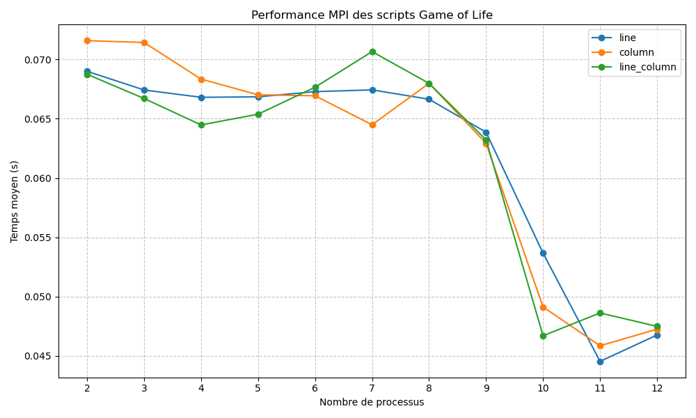

# Projet_GameOfLife
Un groupe de processus qui s'occupe de l'affichage et un autre pour les calculs.

# Auteurs

## DOHEMETO Bonaventure
## BURNS Thomas


# Game of Life MPI Performance Benchmark

Ce dépôt contient des scripts Python pour tester les performances de différentes implémentations parallèles du **Game of Life** en utilisant `MPI` via `mpiexec`.

## Contenu du projet

- `Line/LINE_gol.py` – Implémentation ligne par ligne  
- `Column/COLUMN_gol.py` – Implémentation colonne par colonne  
- `LineAndColumn/LINE_COLUMN.py` – Implémentation mixte lignes et colonnes  
- `gol_performance.txt` – Tableau des temps moyens des tests MPI  
- `gol_performance.png` – Graphique des performances MPI  

## Description du script de benchmark

Le script principal exécute les tests de performance pour différents nombres de processus (`N proc`) et mesure le temps moyen d'exécution pour chaque implémentation.

### Paramètres testés

- **Pattern** : `glider`  
- **Résolution** : 200 × 200  
- **Itérations** : 3  
- **Nombre de processus** : 2 à 12 (1 pour l'affichage + N-1 workers)  

### Exécution

Pour chaque script et chaque nombre de processus, le script :

1. Lance le script via MPI (`mpiexec -n N python script.py pattern resx resy`)  
2. Mesure le temps d'exécution  
3. Calcule le temps moyen sur 3 itérations  

Les résultats sont affichés dans le terminal, sauvegardés dans `gol_performance.txt` et tracés dans `gol_performance.png`.

### Exemple de tableau de performance

| N proc | line     | column   | line_column |
|--------|---------|---------|------------|
| 2      | 0.069005 | 0.071589 | 0.068755 |
| 3      | 0.067427 | 0.071435 | 0.066711 |
| 4      | 0.066812 | 0.068346 | 0.064481 |
| 5      | 0.066850 | 0.067022 | 0.065384 |
| 6      | 0.067289 | 0.066939 | 0.067662 |
| 7      | 0.067436 | 0.064498 | 0.070664 |
| 8      | 0.066650 | 0.067992 | 0.067987 |
| 9      | 0.063867 | 0.062932 | 0.063223 |
| 10     | 0.053665 | 0.049127 | 0.046701 |
| 11     | 0.044539 | 0.045855 | 0.048622 |
| 12     | 0.046763 | 0.047252 | 0.047489 |

### Graphique de performance

Le plot `gol_performance.png` montre l’évolution du temps moyen en fonction du nombre de processus pour chaque implémentation :



## Exigences

- Python 3.x  
- `matplotlib`  
- MPI (OpenMPI ou MPICH)  
- Accès à un terminal avec `mpiexec`  

## Utilisation

1. Cloner le dépôt :  
```bash
git clone <url_du_repo>
cd <nom_du_repo>